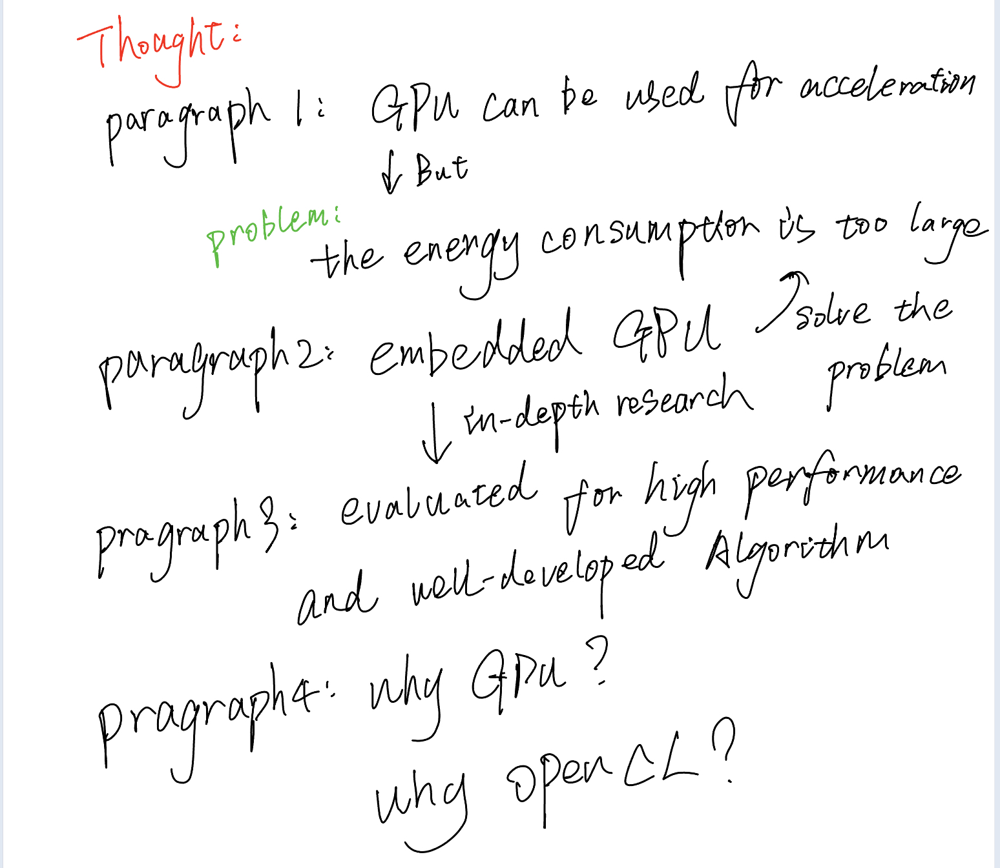

# Introduction

## Theoretical framework

In the past decade, intensive computational tasks have become increasingly prevalent due to research advancements in machine learning, search engine ranking, and asymmetric encryption. With the maturation of GPGPU research, the future trend is towards "heterogeneous computing," which involves leveraging multiple cores, GPUs, and other units to accelerate computationally intensive problems [2]. However, as research progresses, energy consumption has imposed limitations on GPGPUs' performance, particularly when migrating from data centres and supercomputers to battery-powered mobile devices [1]. Until recently, in the past 18 months, programmable GPUs have entered the realm of embedded platforms, providing graphic software designers with powerful programmable engines [2].

## Existing literature

Heterogeneous computing, which involves parallel computing using both GPUs and CPUs, has become a research hotspot in parallel/distributed computing due to its cost-effective, high-performance computing capabilities, good scalability, high resource utilisation, and significant development potential. To pursue speed and improve real-time performance, in the widely adopted Multiple-input multiple-output (MIMO) radar systems in the military, Gaogao Liu et al. (2022) optimised the previously used algorithms by applying OpenMP for coarse-grained acceleration in the outer layer of the framework, accelerating it on the CPU, while fine-grained data processing was accelerated on the GPU. They proposed a parallel simulation system for MIMO radar based on CPU/GPU architecture. Experimental results showed that compared to the serial sequential CPU method, the GPU simulation speed was improved by 130 times [3]. Similarly, in the medical field, Mengyang Zhao et al. (2020) introduced a new online seed optimisation strategy (OSOP) to adaptively determine the minimum number of seeds, thereby accelerating computation and saving GPU memory [4]. In the context of communication and edge computing, Qunsong Zeng et al. (2021) proposed a novel C2RM framework that optimised energy requirements and improved speed [5]. However, unfortunately, the mentioned systems and algorithms have been applied on large-scale GPUs and may not be suitable for more resource-constrained scenarios due to their energy consumption limitations. Although Qunsong Zeng et al. have recognised and attempted to address this issue, significant progress has yet to be made.

If the low-power embedded platforms cannot fully leverage GPGPU capabilities, heterogeneous computing will continue to be limited. Programmable GPUs have made their way into embedded platforms to expand the versatility and enable powerful heterogeneous computing on embedded devices. Fitsum Assamnew Andargie et al. (2017) proposed a mobile GPU-based object detection algorithm and system that achieved twice the efficiency and saved up to 84% energy compared to running OpenCV on the CPU of the same smartphone [6]. This demonstrates the significant potential of embedded GPUs.

As research on embedded GPUs has progressed, Ivan Grasso et al. (2014) have evaluated the performance and energy capabilities of System-on-Chip (SoC) embedded systems. They analysed embedded GPUs' performance and energy advantages in high-performance computing (HPC). The results indicate that embedded GPUs possess performance and energy characteristics that make them viable candidates for future HPC systems [7]. Furthermore, AMIT KUMAR SINGH et al. (2017) proposed an energy-efficient runtime mapping and thread partitioning method for concurrently executing applications on embedded GPUs and CPU cores. On average, it achieved 32% energy savings while meeting performance requirements[8].

In embedded devices, there are various hardware accelerators available. However, this paper chose GPU as the preferred hardware for several reasons. Murad Qasaimeh et al. (2019) compared the energy consumption and efficiency of multi-core CPUs, GPUs, and FPGAs. The results showed that GPUs achieved a 1.1-3.2 times advantage in terms of energy/frame reduction compared to other simple cores, which aligns with the requirements of this paper[9]. Additionally, according to K Karimi et al. (2010), who compared two different interfaces (CUDA and OpenCL) for programming GPUs, this paper opted for the more versatile OpenCL for development[10].

## research gap

In existing research, the development at the system level has primarily focused on GPGPU and has yet to utilise embedded GPUs extensively. Additionally, the development of embedded GPUs has mostly been limited to the algorithmic stage, and research on system-level aspects has yet to mature. Furthermore, the evaluation of embedded GPU performance needs proper comparisons.

## the current study

The Uxn ecosystem is a little **personal computing stack**. It was designed with an implementation-first mindset with a focus on creating portable graphical applications, the distribution of Uxn projects is akin to sharing game roms for any classic console emulator. The concept of Uxn aligns well with the idea of embedded portability. Therefore, this paper will use the Uxn system as an example to demonstrate the porting of a system originally running on multi-core CPUs to a cross-platform system using the OpenCL API. Various evaluations will be conducted to assess the feasibility of this porting approach and to demonstrate its energy efficiency and effectiveness.

## Reference

[1]

N. Rajovic, N. Puzovic, L. Vilanova, C. Villavieja, and A. Ramirez, ‘The low-power architecture approach towards exascale computing’.

[2]

A. Maghazeh, U. D. Bordoloi, P. Eles, and Z. Peng, ‘General purpose computing on low-power embedded GPUs: Has it come of age?’, in *2013 International Conference on Embedded Computer Systems: Architectures, Modeling, and Simulation (SAMOS)*, Agios konstantinos, Samos Island, Greece: IEEE, Jul. 2013, pp. 1–10. doi: [10.1109/SAMOS.2013.6621099](https://doi.org/10.1109/SAMOS.2013.6621099).

[3]

G. Liu *et al.*, ‘MIMO Radar Parallel Simulation System Based on CPU/GPU Architecture’, *Sensors*, vol. 22, no. 1, p. 396, Jan. 2022, doi: [10.3390/s22010396](https://doi.org/10.3390/s22010396).

[4]

M. Zhao *et al.*, ‘Faster Mean-shift: GPU-accelerated clustering for cosine embedding-based cell segmentation and tracking’, *Medical Image Analysis*, vol. 71, p. 102048, Jul. 2021, doi: [10.1016/j.media.2021.102048](https://doi.org/10.1016/j.media.2021.102048).

[5]

Q. Zeng, Y. Du, K. Huang, and K. K. Leung, ‘Energy-Efficient Resource Management for Federated Edge Learning With CPU-GPU Heterogeneous Computing’, *IEEE Trans. Wireless Commun.*, vol. 20, no. 12, pp. 7947–7962, Dec. 2021, doi: [10.1109/TWC.2021.3088910](https://doi.org/10.1109/TWC.2021.3088910).

[6]

F. A. Andargie, J. Rose, T. Austin, and V. Bertacco, ‘Energy efficient object detection on the mobile GP-GPU’, in *2017 IEEE AFRICON*, Cape Town: IEEE, Sep. 2017, pp. 945–950. doi: [10.1109/AFRCON.2017.8095609](https://doi.org/10.1109/AFRCON.2017.8095609).

[7]

I. Grasso, P. Radojkovic, N. Rajovic, I. Gelado, and A. Ramirez, ‘Energy Efficient HPC on Embedded SoCs: Optimization Techniques for Mali GPU’, in *2014 IEEE 28th International Parallel and Distributed Processing Symposium*, Phoenix, AZ, USA: IEEE, May 2014, pp. 123–132. doi: [10.1109/IPDPS.2014.24](https://doi.org/10.1109/IPDPS.2014.24).

[8]

A. K. Singh, A. Prakash, K. R. Basireddy, G. V. Merrett, and B. M. Al-Hashimi, ‘Energy-Efficient Run-Time Mapping and Thread Partitioning of Concurrent OpenCL Applications on CPU-GPU MPSoCs’, *ACM Trans. Embed. Comput. Syst.*, vol. 16, no. 5s, pp. 1–22, Oct. 2017, doi: [10.1145/3126548](https://doi.org/10.1145/3126548).

[9]

M. Qasaimeh, K. Denolf, J. Lo, K. Vissers, J. Zambreno, and P. H. Jones, ‘Comparing Energy Efficiency of CPU, GPU and FPGA Implementations for Vision Kernels’, in *2019 IEEE International Conference on Embedded Software and Systems (ICESS)*, Las Vegas, NV, USA: IEEE, Jun. 2019, pp. 1–8. doi: [10.1109/ICESS.2019.8782524](https://doi.org/10.1109/ICESS.2019.8782524).

[10]

K. Karimi, ‘A Performance Comparison of CUDA and OpenCL’.

