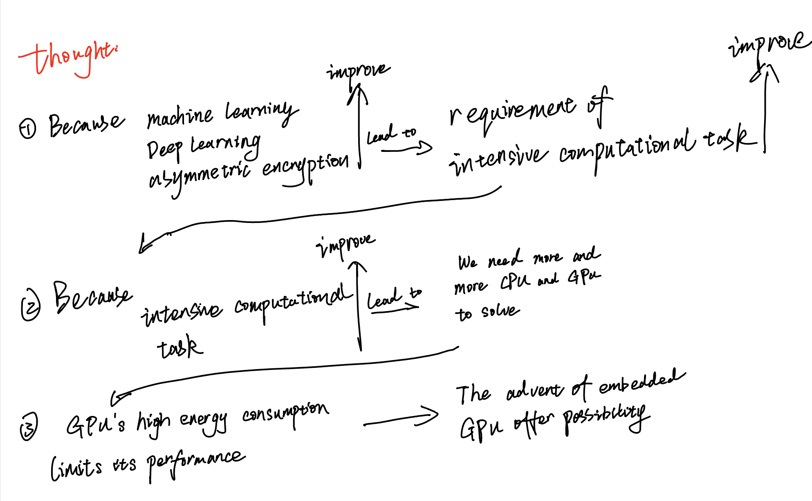
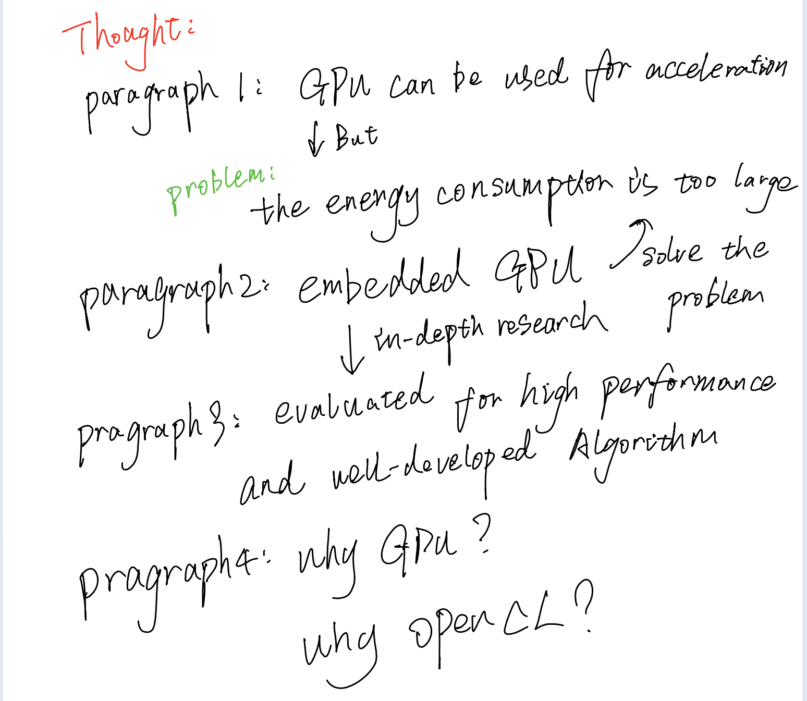
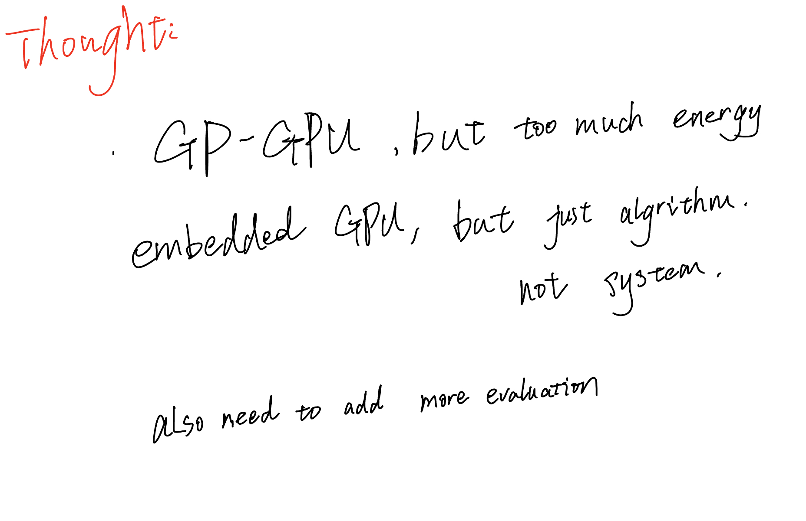

# Introduction

## Theoretical framework

In the past decade, intensive computational tasks have become increasingly prevalent due to research advancements in machine learning, search engine ranking, and asymmetric encryption. With the maturation of GPGPU research, the future trend is towards "heterogeneous computing," which involves leveraging multiple cores, GPUs, and other units to accelerate computationally intensive problems [2]. However, as research progresses, energy consumption has imposed limitations on GPGPUs' performance, particularly when migrating from data centres and supercomputers to battery-powered mobile devices [1]. Until recently, in the past 18 months, programmable GPUs have entered the realm of embedded platforms, providing graphic software designers with powerful programmable engines [2].

在过去十年里，随着人们在机器学习、搜索引擎排序、非对称加密等领域的研究，计算密集型任务已经变得越来越普遍了。随着GPGPU研究的成熟，未来的趋势是"异构计算"，即利用多核、GPU和其他单元协同加速计算密集型问题[2]。 但是随着研究的深入，能量消耗限制了GPGPU从数据中心和超级计算迁移到使用电池的移动设备中可提供的性能[1]。直到最近。在过去的18个月里，可编程GPU已经进入了嵌入式平台，为图形软件设计人员提供了强大的可编程引擎[2]。

## Existing literature

Heterogeneous computing, which involves parallel computing using both GPUs and CPUs, has become a research hotspot in parallel/distributed computing due to its cost-effective, high-performance computing capabilities, good scalability, high resource utilisation, and significant development potential. To pursue speed and improve real-time performance, in the widely adopted Multiple-input multiple-output (MIMO) radar systems in the military, Gaogao Liu et al. (2022) optimised the previously used algorithms by applying OpenMP for coarse-grained acceleration in the outer layer of the framework, accelerating it on the CPU, while fine-grained data processing was accelerated on the GPU. They proposed a parallel simulation system for MIMO radar based on CPU/GPU architecture. Experimental results showed that compared to the serial sequential CPU method, the GPU simulation speed was improved by 130 times [3]. Similarly, in the medical field, Mengyang Zhao et al. (2020) introduced a new online seed optimisation strategy (OSOP) to adaptively determine the minimum number of seeds, thereby accelerating computation and saving GPU memory [4]. In the context of communication and edge computing, Qunsong Zeng et al. (2021) proposed a novel C2RM framework that optimised energy requirements and improved speed [5]. However, unfortunately, the mentioned systems and algorithms have been applied on large-scale GPUs and may not be suitable for more resource-constrained scenarios due to their energy consumption limitations. Although Qunsong Zeng et al. have recognised and attempted to address this issue, significant progress has yet to be made.

使用GPU和CPU进行并行计算，即异构计算，由于它能经济有效地获取高性能计算能力、可扩展性好、计算资源利用率高、发展潜力巨大，已成为并行/分布计算领域中的研究热点之一。为了追求速度，提升实时性，在目前军方广泛采用的Multiple-input multiple-output (MIMO) 雷达中，Gaogao Liu等人(2022)优化了先前使用的算法，将框架的外层采用OpenMP进行粗粒度加速，用于在CPU上加速；内层细粒度数据处理则在GPU上进行加速。并在此基础上提出了基于CPU/GPU架构的MIMO雷达并行仿真系统。实验结果表明，与串行顺序CPU方法相比，GPU仿真速度提高了130倍[3]。同样是追求速度的提升，在医学方面，Mengyang Zhao等人(2020)引入了一种新的在线种子优化策略（OSOP），以自适应地确定最小种子数，加速计算并节省GPU内存[4]。而在通信与边缘计算结方面Qunsong Zeng等人(2021)已经提出了一种新颖的C2RM框架[5]，优化了原本所需要的能量和提升了速度。但遗憾的是，上述系统和算法皆运用在大型GPU上，因为其能耗的限制，并不能适用于更丰富的场景。尽管Qunsong Zeng等人已经意识到这个问题并且尝试解决，但是并没有很好的进展。

If the low-power embedded platforms cannot fully leverage GPGPU capabilities, heterogeneous computing will continue to be limited. Programmable GPUs have made their way into embedded platforms to expand the versatility and enable powerful heterogeneous computing on embedded devices. Fitsum Assamnew Andargie et al. (2017) proposed a mobile GPU-based object detection algorithm and system that achieved twice the efficiency and saved up to 84% energy compared to running OpenCV on the CPU of the same smartphone [6]. This demonstrates the significant potential of embedded GPUs.

如果不能充分利用低功耗嵌入式平台上的GPGPU，异构计算将仍然受到限制。为了拓展泛用性，使得嵌入式设备中也可以使用GPU来进行强大的异构计算，可编程GPU已经进入了嵌入式平台。Fitsum Assamnew Andargie等人(2017)提出了一种基于移动GP-GPU的目标检测算法和系统，与在同一款智能手机的CPU上运行的OpenCV相比，该系统的效率提高了两倍，并节省了高达84%的能量[6]。从而可以看出，嵌入式GPU具有强大的潜力。

As research on embedded GPUs has progressed, Ivan Grasso et al. (2014) have evaluated the performance and energy capabilities of System-on-Chip (SoC) embedded systems. They analysed embedded GPUs' performance and energy advantages in high-performance computing (HPC). The results indicate that embedded GPUs possess performance and energy characteristics that make them viable candidates for future HPC systems [7]. Furthermore, AMIT KUMAR SINGH et al. (2017) proposed an energy-efficient runtime mapping and thread partitioning method for concurrently executing applications on embedded GPUs and CPU cores. On average, it achieved 32% energy savings while meeting performance requirements[8].

随着对嵌入式GPU研究的深入，Ivan Grasso等人(2014)已经对嵌入式系统芯片（SoCs）的性能和能量能力进行评估。分析了嵌入式GPU在高性能计算(HPC)方面的性能和能量优势[7]。结果表明，嵌入式GPU具有性能和能量特性，使其成为未来HPC系统的候选方案。并且AMIT KUMAR SINGH等人(2017)提出了一种能量高效的运行时映射和线程分割方法，用于在嵌入式GPU和CPU核心上同时执行并发的应用程序。平均节能达到32％，同时仍满足性能要求[8]。

In embedded devices, there are various hardware accelerators available. However, this paper chose GPU as the preferred hardware for several reasons. Murad Qasaimeh et al. (2019) compared the energy consumption and efficiency of multi-core CPUs, GPUs, and FPGAs. The results showed that GPUs achieved a 1.1-3.2 times advantage in terms of energy/frame reduction compared to other simple cores, which aligns with the requirements of this paper[9]. Additionally, according to K Karimi et al. (2010), who compared two different interfaces (CUDA and OpenCL) for programming GPUs, this paper opted for the more versatile OpenCL for development[10].

在嵌入式设备中存在各种硬件加速器，为什么本文选用了GPU作为首选硬件呢？Murad Qasaimeh等人（2019）对比了多核CPU、GPU和FPGA的能耗与效率。结果显示，与其他简单的核心相比，GPU在能量/帧降低比方面实现了1.1-3.2倍的优势[9]，正好符合本文的需求。并且根据K Karimi等人(2010)对用于编程GPU两种不同的接口（CUDA和OpenCL）进行比较，最终本文选择了泛用性较高的OpenCL进行开发[10]。

## research gap

In existing research, the development at the system level has primarily focused on GPGPU and has yet to utilise embedded GPUs extensively. Additionally, the development of embedded GPUs has mostly been limited to the algorithmic stage, and research on system-level aspects has yet to mature. Furthermore, the evaluation of embedded GPU performance needs proper comparisons.

但是在现存的研究中，在系统层面的开发都停留在GPGPU，并没有使用嵌入式GPU。而对于嵌入式GPU的开发都停留在算法阶段，对于系统层面的研究并不成熟。并且对于嵌入式GPU性能的评估并没有进行对照。

## the current study

The Uxn ecosystem is a little **personal computing stack**. It was designed with an implementation-first mindset with a focus on creating portable graphical applications, the distribution of Uxn projects is akin to sharing game roms for any classic console emulator. The concept of Uxn aligns well with the idea of embedded portability. Therefore, this paper will use the Uxn system as an example to demonstrate the porting of a system originally running on multi-core CPUs to a cross-platform system using the OpenCL API. Various evaluations will be conducted to assess the feasibility of this porting approach and to demonstrate its energy efficiency and effectiveness.

Uxn 生态系统是一个小小的**个人计算堆栈**。 它的设计理念是实现优先，专注于创建便携式图形应用程序，Uxn 项目的分发类似于共享任何经典控制台模拟器的游戏 ROM。Uxn的概念与嵌入式便携不谋而合。所以本文将以Uxn系统为例子，使用OpenCL API将原本运行与多核CPU的系统移植为跨平台系统。并且通过多种评估评价这种移植的可行性和证明其功耗和效率。

## Reference

[1]

N. Rajovic, N. Puzovic, L. Vilanova, C. Villavieja, and A. Ramirez, ‘The low-power architecture approach towards exascale computing’.

[2]

A. Maghazeh, U. D. Bordoloi, P. Eles, and Z. Peng, ‘General purpose computing on low-power embedded GPUs: Has it come of age?’, in *2013 International Conference on Embedded Computer Systems: Architectures, Modeling, and Simulation (SAMOS)*, Agios konstantinos, Samos Island, Greece: IEEE, Jul. 2013, pp. 1–10. doi: [10.1109/SAMOS.2013.6621099](https://doi.org/10.1109/SAMOS.2013.6621099).

[3]

G. Liu *et al.*, ‘MIMO Radar Parallel Simulation System Based on CPU/GPU Architecture’, *Sensors*, vol. 22, no. 1, p. 396, Jan. 2022, doi: [10.3390/s22010396](https://doi.org/10.3390/s22010396).

[4]

M. Zhao *et al.*, ‘Faster Mean-shift: GPU-accelerated clustering for cosine embedding-based cell segmentation and tracking’, *Medical Image Analysis*, vol. 71, p. 102048, Jul. 2021, doi: [10.1016/j.media.2021.102048](https://doi.org/10.1016/j.media.2021.102048).

[5]

Q. Zeng, Y. Du, K. Huang, and K. K. Leung, ‘Energy-Efficient Resource Management for Federated Edge Learning With CPU-GPU Heterogeneous Computing’, *IEEE Trans. Wireless Commun.*, vol. 20, no. 12, pp. 7947–7962, Dec. 2021, doi: [10.1109/TWC.2021.3088910](https://doi.org/10.1109/TWC.2021.3088910).

[6]

F. A. Andargie, J. Rose, T. Austin, and V. Bertacco, ‘Energy efficient object detection on the mobile GP-GPU’, in *2017 IEEE AFRICON*, Cape Town: IEEE, Sep. 2017, pp. 945–950. doi: [10.1109/AFRCON.2017.8095609](https://doi.org/10.1109/AFRCON.2017.8095609).

[7]

I. Grasso, P. Radojkovic, N. Rajovic, I. Gelado, and A. Ramirez, ‘Energy Efficient HPC on Embedded SoCs: Optimization Techniques for Mali GPU’, in *2014 IEEE 28th International Parallel and Distributed Processing Symposium*, Phoenix, AZ, USA: IEEE, May 2014, pp. 123–132. doi: [10.1109/IPDPS.2014.24](https://doi.org/10.1109/IPDPS.2014.24).

[8]

A. K. Singh, A. Prakash, K. R. Basireddy, G. V. Merrett, and B. M. Al-Hashimi, ‘Energy-Efficient Run-Time Mapping and Thread Partitioning of Concurrent OpenCL Applications on CPU-GPU MPSoCs’, *ACM Trans. Embed. Comput. Syst.*, vol. 16, no. 5s, pp. 1–22, Oct. 2017, doi: [10.1145/3126548](https://doi.org/10.1145/3126548).

[9]

M. Qasaimeh, K. Denolf, J. Lo, K. Vissers, J. Zambreno, and P. H. Jones, ‘Comparing Energy Efficiency of CPU, GPU and FPGA Implementations for Vision Kernels’, in *2019 IEEE International Conference on Embedded Software and Systems (ICESS)*, Las Vegas, NV, USA: IEEE, Jun. 2019, pp. 1–8. doi: [10.1109/ICESS.2019.8782524](https://doi.org/10.1109/ICESS.2019.8782524).

[10]

K. Karimi, ‘A Performance Comparison of CUDA and OpenCL’.

